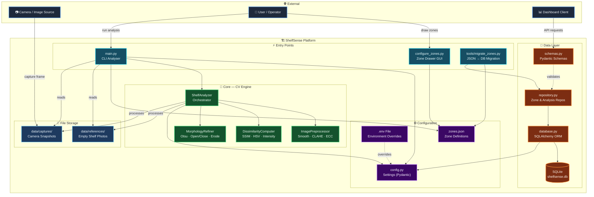
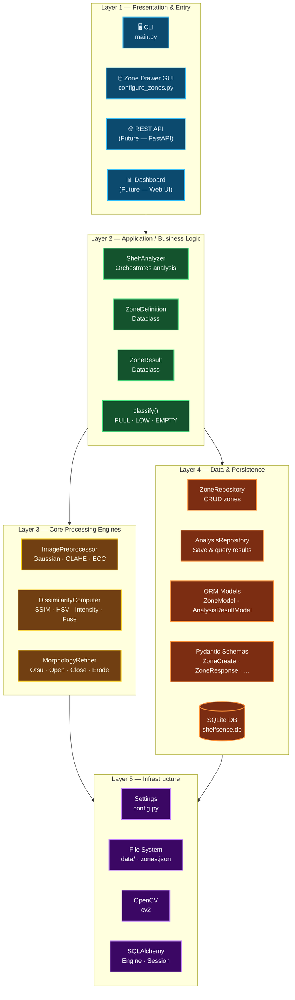
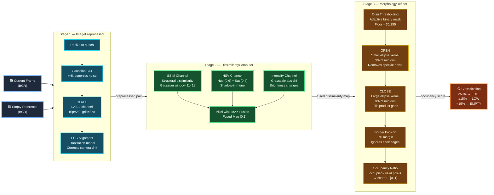
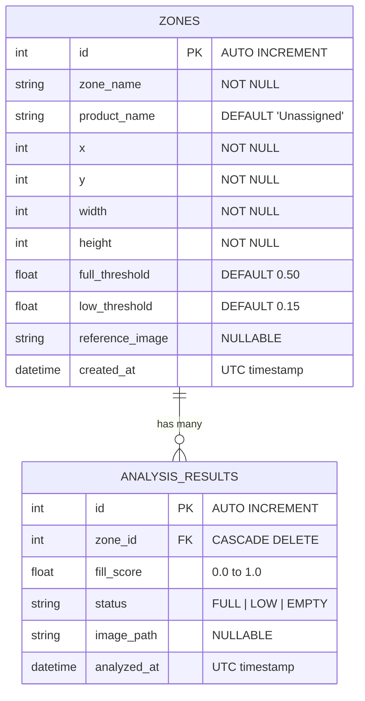
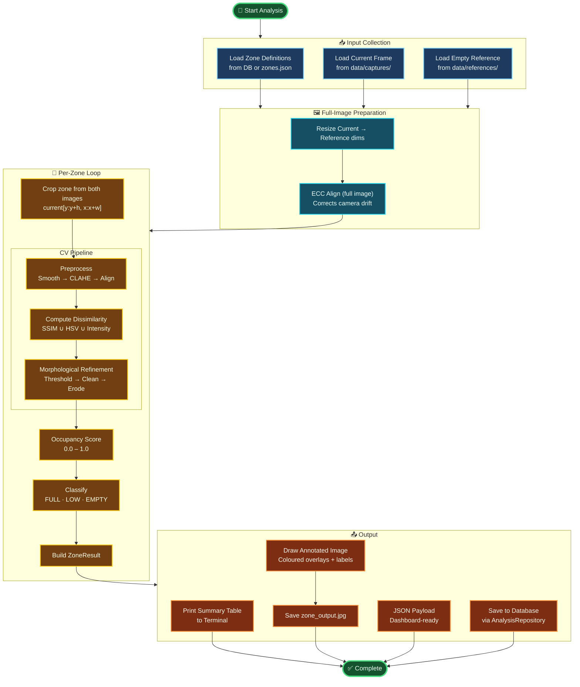
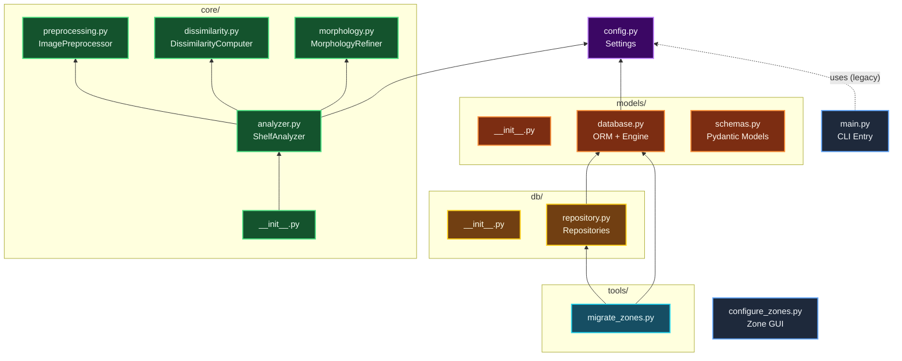
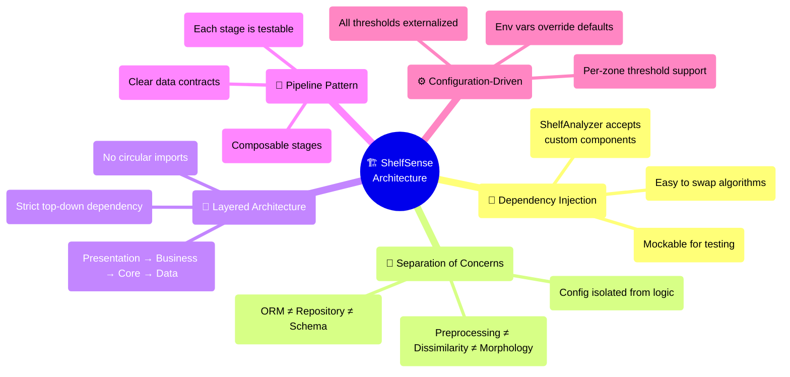

# ShelfSense — Architecture Design Diagram

> **Version**: 2.0 (OOP Refactored)  
> **Generated**: July 2026  
> **Purpose**: Visual reference for the full system architecture of the ShelfSense shelf-occupancy monitoring platform.

---

## 1. High-Level System Overview

A bird's-eye view of all major components and their relationships.



---

## 2. Layered Architecture

The system follows a clean **4-layer architecture** with strict dependency direction (top → bottom).



---

## 3. CV Pipeline — Internal Architecture

Detailed view of the three-stage computer vision pipeline inside `core/`.



---

## 4. Data Model (ERD)

Entity-Relationship diagram showing the database schema and table relationships.



---

## 5. Data Flow — End-to-End Analysis Run

Complete data flow from image capture through to persisted results.



---

## 6. Module Dependency Graph

Shows which modules import from which — useful for understanding coupling.



---

## 7. Directory Structure

```
ShelfSense/
├── main.py                     # CLI entry point (legacy monolith)
├── config.py                   # Centralized settings (Pydantic)
├── configure_zones.py          # Interactive zone drawing tool (OpenCV GUI)
├── zones.json                  # Zone definitions (legacy flat file)
├── requirements.txt            # Python dependencies
│
├── core/                       # 🧠 Computer Vision Engine
│   ├── __init__.py             #   Exports ShelfAnalyzer
│   ├── analyzer.py             #   Orchestrator (composes the 3 stages)
│   ├── preprocessing.py        #   Stage 1: Smooth → CLAHE → ECC Align
│   ├── dissimilarity.py        #   Stage 2: SSIM · HSV · Intensity → Fuse
│   └── morphology.py           #   Stage 3: Otsu → Open/Close → Border Erode
│
├── models/                     # 💾 Data Definitions
│   ├── __init__.py
│   ├── database.py             #   SQLAlchemy ORM models + engine setup
│   └── schemas.py              #   Pydantic request/response schemas
│
├── db/                         # 🗄️ Repository Layer
│   ├── __init__.py
│   └── repository.py           #   ZoneRepository + AnalysisRepository
│
├── tools/                      # 🔧 Utilities
│   ├── __init__.py
│   └── migrate_zones.py        #   One-time JSON → SQLite migration
│
├── tests/                      # ✅ Test Suite
│   ├── __init__.py
│   ├── test_analyzer.py        #   CV pipeline unit tests
│   └── test_repository.py      #   Database CRUD tests
│
└── data/                       # 📁 Runtime Data
    ├── references/             #   Empty shelf reference photos
    ├── captures/               #   Camera snapshot storage
    └── shelfsense.db           #   SQLite database (auto-created)
```

---

## 8. Technology Stack

| Layer | Technology | Purpose |
|-------|-----------|---------|
| **Language** | Python 3.12+ | Core runtime |
| **CV Engine** | OpenCV (cv2) | Image processing, SSIM, morphology, ECC alignment |
| **Numerical** | NumPy | Array operations, matrix math |
| **ORM** | SQLAlchemy 2.x | Database abstraction, model mapping |
| **Database** | SQLite 3 | Lightweight embedded storage |
| **Config** | Pydantic Settings | Type-safe configuration with `.env` support |
| **Validation** | Pydantic v2 | Request/response schema validation |
| **Testing** | pytest | Unit and integration testing |
| **Object Detection** | YOLOv8 (ultralytics) | Pre-trained model available (`yolov8n.pt`) |

---

## 9. Design Principles


