# ShelfSense — Class Diagram

```mermaid
classDiagram
    direction TB

    %% ━━━━━━━━━━━━━━━━━━━━━━━━━━━━━━━━━━━━━━━━━━━━━━━━━━━━━━━━━━━━━
    %% CONFIGURATION LAYER
    %% ━━━━━━━━━━━━━━━━━━━━━━━━━━━━━━━━━━━━━━━━━━━━━━━━━━━━━━━━━━━━━

    class Settings {
        <<BaseSettings>>
        +str DATABASE_URL
        +float FULL_THRESHOLD
        +float LOW_THRESHOLD
        +Path REFERENCES_DIR
        +Path CAPTURES_DIR
        +int ANALYSIS_INTERVAL_MINUTES
        +str HOST
        +int PORT
        +int|str CAMERA_SOURCE
        +bool CAMERA_ENABLED
        +bool NOTIFICATIONS_ENABLED
        +list~str~ NOTIFICATION_BACKENDS
    }

    %% ━━━━━━━━━━━━━━━━━━━━━━━━━━━━━━━━━━━━━━━━━━━━━━━━━━━━━━━━━━━━━
    %% CORE CV PIPELINE
    %% ━━━━━━━━━━━━━━━━━━━━━━━━━━━━━━━━━━━━━━━━━━━━━━━━━━━━━━━━━━━━━

    class ShelfAnalyzer {
        +ImagePreprocessor preprocessor
        +DissimilarityComputer dissimilarity
        +MorphologyRefiner morphology
        +float full_threshold
        +float low_threshold
        +classify(score, full_threshold, low_threshold) str
        +analyze_zone(zone_crop, ref_crop) float
        +analyze_shelf(current_image, reference_image, zones) list~ZoneResult~
        +draw_results(image, results)$ ndarray
    }

    class ImagePreprocessor {
        +int blur_ksize
        +float clahe_clip
        +tuple clahe_grid
        +int ecc_max_iter
        +float ecc_epsilon
        +smooth(img) ndarray
        +normalize_lighting(img) ndarray
        +align(current, reference) ndarray
        +preprocess(current, reference) tuple
    }

    class DissimilarityComputer {
        -float _C1
        -float _C2
        +int ssim_window_size
        +float ssim_sigma
        +float hue_weight
        +float sat_weight
        +ssim(gray_a, gray_b) ndarray
        +color_hsv(img_a, img_b) ndarray
        +intensity(img_a, img_b) ndarray
        +fuse(maps) ndarray
        +compute_all(zone_img, ref_img) ndarray
    }

    class MorphologyRefiner {
        +int min_threshold
        +float small_kernel_frac
        +float large_kernel_frac
        +float border_frac
        +threshold(fused_map) ndarray
        +cleanup(binary) ndarray
        +erode_borders(mask) tuple
        +refine(fused_map) float
    }

    %% ━━━━━━━━━━━━━━━━━━━━━━━━━━━━━━━━━━━━━━━━━━━━━━━━━━━━━━━━━━━━━
    %% DATA CLASSES (core.analyzer)
    %% ━━━━━━━━━━━━━━━━━━━━━━━━━━━━━━━━━━━━━━━━━━━━━━━━━━━━━━━━━━━━━

    class ZoneDefinition {
        <<dataclass>>
        +int zone_id
        +str zone_name
        +str product_name
        +int x
        +int y
        +int width
        +int height
        +float full_threshold
        +float low_threshold
    }

    class ZoneResult {
        <<dataclass>>
        +int zone_id
        +str zone_name
        +str product_name
        +float fill_score
        +str status
        +int x
        +int y
        +int width
        +int height
        +datetime analyzed_at
    }

    %% ━━━━━━━━━━━━━━━━━━━━━━━━━━━━━━━━━━━━━━━━━━━━━━━━━━━━━━━━━━━━━
    %% ORM MODELS (models.database)
    %% ━━━━━━━━━━━━━━━━━━━━━━━━━━━━━━━━━━━━━━━━━━━━━━━━━━━━━━━━━━━━━

    class Base {
        <<DeclarativeBase>>
    }

    class ZoneModel {
        <<SQLAlchemy ORM>>
        +int id
        +str zone_name
        +str product_name
        +int x
        +int y
        +int width
        +int height
        +float full_threshold
        +float low_threshold
        +str reference_image
        +datetime created_at
        +list~AnalysisResultModel~ results
    }

    class AnalysisResultModel {
        <<SQLAlchemy ORM>>
        +int id
        +int zone_id
        +float fill_score
        +str status
        +str image_path
        +datetime analyzed_at
        +ZoneModel zone
    }

    %% ━━━━━━━━━━━━━━━━━━━━━━━━━━━━━━━━━━━━━━━━━━━━━━━━━━━━━━━━━━━━━
    %% PYDANTIC SCHEMAS (models.schemas)
    %% ━━━━━━━━━━━━━━━━━━━━━━━━━━━━━━━━━━━━━━━━━━━━━━━━━━━━━━━━━━━━━

    class ZoneCreate {
        <<Pydantic>>
        +str zone_name
        +str product_name
        +int x
        +int y
        +int width
        +int height
        +float full_threshold
        +float low_threshold
        +str|None reference_image
    }

    class ZoneUpdate {
        <<Pydantic>>
        +str|None zone_name
        +str|None product_name
        +int|None x
        +int|None y
        +int|None width
        +int|None height
        +float|None full_threshold
        +float|None low_threshold
        +str|None reference_image
    }

    class ZoneResponse {
        <<Pydantic>>
        +int id
        +str zone_name
        +str product_name
        +int x
        +int y
        +int width
        +int height
        +float full_threshold
        +float low_threshold
        +str|None reference_image
        +datetime created_at
    }

    class AnalysisResultResponse {
        <<Pydantic>>
        +int id
        +int zone_id
        +str zone_name
        +str product_name
        +float fill_score
        +str status
        +str|None image_path
        +datetime analyzed_at
    }

    class ShelfStatusResponse {
        <<Pydantic>>
        +datetime|None analyzed_at
        +str|None image_path
        +list~AnalysisResultResponse~ zones
        +dict summary
    }

    %% ━━━━━━━━━━━━━━━━━━━━━━━━━━━━━━━━━━━━━━━━━━━━━━━━━━━━━━━━━━━━━
    %% REPOSITORY LAYER (db.repository)
    %% ━━━━━━━━━━━━━━━━━━━━━━━━━━━━━━━━━━━━━━━━━━━━━━━━━━━━━━━━━━━━━

    class ZoneRepository {
        +Session session
        +get_all() list~ZoneModel~
        +get_by_id(zone_id) ZoneModel|None
        +create(**kwargs) ZoneModel
        +update(zone_id, **kwargs) ZoneModel|None
        +delete(zone_id) bool
        +count() int
    }

    class AnalysisRepository {
        +Session session
        +save_result(**kwargs) AnalysisResultModel
        +save_batch(results) list~AnalysisResultModel~
        +get_latest() list~AnalysisResultModel~
        +get_history(zone_id, limit) list~AnalysisResultModel~
        +get_alerts(statuses) list~AnalysisResultModel~
        +count() int
    }

    %% ━━━━━━━━━━━━━━━━━━━━━━━━━━━━━━━━━━━━━━━━━━━━━━━━━━━━━━━━━━━━━
    %% RELATIONSHIPS
    %% ━━━━━━━━━━━━━━━━━━━━━━━━━━━━━━━━━━━━━━━━━━━━━━━━━━━━━━━━━━━━━

    %% Composition — ShelfAnalyzer owns its pipeline stages
    ShelfAnalyzer *-- ImagePreprocessor : preprocessor
    ShelfAnalyzer *-- DissimilarityComputer : dissimilarity
    ShelfAnalyzer *-- MorphologyRefiner : morphology

    %% ShelfAnalyzer depends on data classes
    ShelfAnalyzer ..> ZoneDefinition : accepts as input
    ShelfAnalyzer ..> ZoneResult : produces

    %% ShelfAnalyzer reads thresholds from Settings
    ShelfAnalyzer ..> Settings : reads thresholds

    %% ORM Inheritance
    ZoneModel --|> Base
    AnalysisResultModel --|> Base

    %% ORM Relationship (1-to-many)
    ZoneModel "1" --> "*" AnalysisResultModel : results

    %% Pydantic Inheritance
    ZoneCreate --|> BaseModel
    ZoneUpdate --|> BaseModel
    ZoneResponse --|> BaseModel
    AnalysisResultResponse --|> BaseModel
    ShelfStatusResponse --|> BaseModel

    %% ShelfStatusResponse aggregates AnalysisResultResponse
    ShelfStatusResponse *-- AnalysisResultResponse : zones

    %% Repository → ORM dependency
    ZoneRepository ..> ZoneModel : queries / persists
    AnalysisRepository ..> AnalysisResultModel : queries / persists

    %% Pydantic schemas serialize ORM models
    ZoneResponse ..> ZoneModel : serializes
    AnalysisResultResponse ..> AnalysisResultModel : serializes
    ZoneCreate ..> ZoneModel : validates input for
    ZoneUpdate ..> ZoneModel : validates input for

    class BaseModel {
        <<Pydantic>>
    }
```

## Legend

| Symbol | Meaning |
|--------|---------|
| `*--` | **Composition** — the child cannot exist without the parent |
| `-->` | **Association** — one-to-many relationship |
| `--|>` | **Inheritance** — child extends parent |
| `..>` | **Dependency** — uses / depends on |

## Package Overview

| Package | Classes | Role |
|---------|---------|------|
| `config` | `Settings` | Centralized app configuration via Pydantic BaseSettings |
| `core` | `ShelfAnalyzer`, `ImagePreprocessor`, `DissimilarityComputer`, `MorphologyRefiner`, `ZoneDefinition`, `ZoneResult` | CV pipeline — image preprocessing, multi-channel dissimilarity, morphological cleanup, and orchestration |
| `models.database` | `Base`, `ZoneModel`, `AnalysisResultModel` | SQLAlchemy ORM table definitions + engine/session setup |
| `models.schemas` | `ZoneCreate`, `ZoneUpdate`, `ZoneResponse`, `AnalysisResultResponse`, `ShelfStatusResponse` | Pydantic request/response schemas for the API layer |
| `db.repository` | `ZoneRepository`, `AnalysisRepository` | Data access layer — all CRUD operations |
