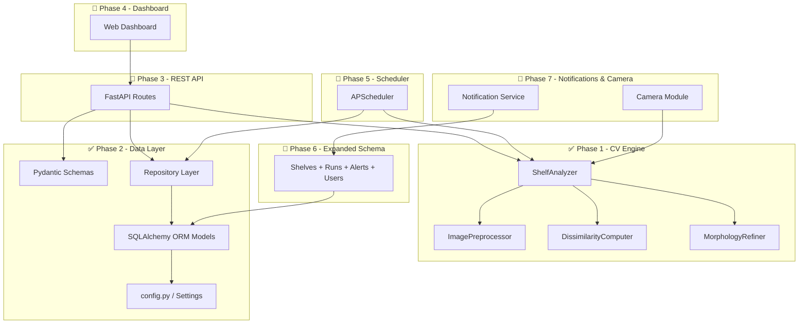

# ShelfSense — Reconstructed Implementation Plan

> [!NOTE]
> This plan was **reconstructed** by analysing your existing codebase, ERD, `requirements.txt` phase comments, and `config.py` prepared settings. The previous chat history was lost during the Antigravity reinstall.

---

## Completed Phases

### ✅ Phase 1 — Computer Vision Engine (DONE)
Built the core shelf-occupancy estimation pipeline:

| File | Purpose |
|---|---|
| [main.py](file:///c:/Users/Ashraf/ShelfSense/main.py) | Original monolithic script (V2 algorithm) |
| [core/preprocessing.py](file:///c:/Users/Ashraf/ShelfSense/core/preprocessing.py) | `ImagePreprocessor` — Gaussian blur, CLAHE, ECC alignment |
| [core/dissimilarity.py](file:///c:/Users/Ashraf/ShelfSense/core/dissimilarity.py) | `DissimilarityComputer` — SSIM + HSV + Intensity fusion |
| [core/morphology.py](file:///c:/Users/Ashraf/ShelfSense/core/morphology.py) | `MorphologyRefiner` — Otsu threshold, OPEN/CLOSE cleanup, border erosion |
| [core/analyzer.py](file:///c:/Users/Ashraf/ShelfSense/core/analyzer.py) | `ShelfAnalyzer` — orchestrator composing all 3 stages |
| [configure_zones.py](file:///c:/Users/Ashraf/ShelfSense/configure_zones.py) | Interactive OpenCV tool to draw zones on a reference image |
| [tests/test_analyzer.py](file:///c:/Users/Ashraf/ShelfSense/tests/test_analyzer.py) | Unit tests for the CV pipeline |

---

### ✅ Phase 2 — Data Layer (DONE)
Added database persistence (SQLite + SQLAlchemy):

| File | Purpose |
|---|---|
| [config.py](file:///c:/Users/Ashraf/ShelfSense/config.py) | `Settings` (Pydantic BaseSettings) — DB URL, thresholds, paths, server config |
| [models/database.py](file:///c:/Users/Ashraf/ShelfSense/models/database.py) | ORM models: `ZoneModel`, `AnalysisResultModel` + engine/session setup |
| [models/schemas.py](file:///c:/Users/Ashraf/ShelfSense/models/schemas.py) | Pydantic schemas: `ZoneCreate`, `ZoneUpdate`, `ZoneResponse`, `AnalysisResultResponse`, `ShelfStatusResponse` |
| [db/repository.py](file:///c:/Users/Ashraf/ShelfSense/db/repository.py) | `ZoneRepository` (CRUD) + `AnalysisRepository` (save/query results, alerts) |
| [tools/migrate_zones.py](file:///c:/Users/Ashraf/ShelfSense/tools/migrate_zones.py) | One-time migration: `zones.json` → SQLite |
| [tests/test_repository.py](file:///c:/Users/Ashraf/ShelfSense/tests/test_repository.py) | Unit tests for the repository layer |
| [erd_ShelfSense](file:///c:/Users/Ashraf/ShelfSense/erd_ShelfSense) | Full 6-table ERD (target design for all phases) |

**Currently implemented tables**: `zones`, `analysis_results`
**Target tables** (from ERD): `users`, `shelves`, `zones`, `analysis_runs`, `analysis_results`, `alerts`

---

## Remaining Phases

### 🔲 Phase 3 — REST API (FastAPI)
Build the backend API that connects the CV engine + database to the outside world.

**Dependencies already in `requirements.txt`**: `fastapi`, `uvicorn`, `python-multipart`
**Server config already in `config.py`**: `HOST=127.0.0.1`, `PORT=8000`

#### Proposed scope:
- **`api/`** package with route modules:
  - `api/zones.py` — CRUD endpoints for zones (`POST/GET/PUT/DELETE /api/zones`)
  - `api/analysis.py` — Trigger analysis, get latest status, get history (`POST /api/analyze`, `GET /api/status`, `GET /api/zones/{id}/history`)
  - `api/uploads.py` — Upload reference images and camera captures
- **`app.py`** — FastAPI application factory, CORS, lifespan (init_db on startup)
- **Dependency injection** — `get_db()` session dependency for all routes
- Wire `ShelfAnalyzer` to the API: accept an uploaded image → run CV pipeline → save results to DB → return JSON
- Swagger/OpenAPI auto-docs at `/docs`

---

### 🔲 Phase 4 — Dashboard (Frontend)
Build a web dashboard to visualize shelf status in real-time.

#### Proposed scope:
- **Tech**: HTML/CSS/JS served by FastAPI's `StaticFiles` (or a simple Vite app if preferred)
- **Pages**:
  - **Dashboard home** — grid/cards showing each zone's current status (FULL/LOW/EMPTY) with color coding
  - **Zone detail** — trend chart (fill_score over time), zone metadata, last analyzed image
  - **Zone management** — add/edit/delete zones, draw zones on the reference image
  - **Analysis history** — table of past analysis runs
- **Design**: Dark mode, glassmorphism cards, animated status indicators, responsive layout

---

### 🔲 Phase 5 — Scheduler (Automated Analysis)
Run the CV pipeline automatically at a configurable interval.

**Dependencies already in `requirements.txt`**: `apscheduler`
**Config already in `config.py`**: `ANALYSIS_INTERVAL_MINUTES=5`

#### Proposed scope:
- **`services/scheduler.py`** — APScheduler job that:
  1. Captures image from camera (or loads latest from `data/captures/`)
  2. Loads zones from DB
  3. Runs `ShelfAnalyzer.analyze_shelf()`
  4. Saves results via `AnalysisRepository`
  5. Triggers alerts if any zone is LOW/EMPTY
- Integrate with FastAPI lifespan (start scheduler on app boot, stop on shutdown)
- API endpoints to pause/resume/trigger-now the scheduler

---

### 🔲 Phase 6 — Expanded Database Schema
Implement the remaining tables from the [ERD](file:///c:/Users/Ashraf/ShelfSense/erd_ShelfSense):

| Table | Purpose |
|---|---|
| `shelves` | Physical shelf units (groups zones, holds camera source) |
| `analysis_runs` | Groups results per scan (replaces per-result `image_path` + timestamp) |
| `alerts` | Automatic LOW/EMPTY alerts with send/acknowledge tracking |
| `users` | Staff/admin accounts for dashboard access |

- Add `shelf_id` FK to `zones`
- Refactor `analysis_results` to use `run_id` FK instead of standalone `image_path`/`analyzed_at`
- Alert service: auto-create alerts when status is LOW/EMPTY
- Update repositories and API routes accordingly

---

### 🔲 Phase 7 — Notifications & Camera Integration
Connect the system to real-world inputs and outputs.

**Config already prepared in `config.py`**: `CAMERA_SOURCE`, `CAMERA_ENABLED`, `NOTIFICATIONS_ENABLED`, `NOTIFICATION_BACKENDS`

#### Proposed scope:
- **Camera module** — Capture frames from webcam or RTSP stream
- **Notification service** — Send alerts via email/SMS/webhook when zones go LOW or EMPTY
- **Alert acknowledgment** — Staff can mark alerts as acknowledged from the dashboard

---

## Current Project Architecture

---

## User Review Required

> [!IMPORTANT]
> This plan was reconstructed from your code. Please confirm:
> 1. **Does this match the original plan you had?** If anything is missing or different, let me know and I'll adjust.
> 2. **Are you ready to start Phase 3 (REST API)?** That's the natural next step.
> 3. **Phase ordering** — The ERD suggests Phases 5-6 could be swapped (expanded schema before scheduler). Which do you prefer?

