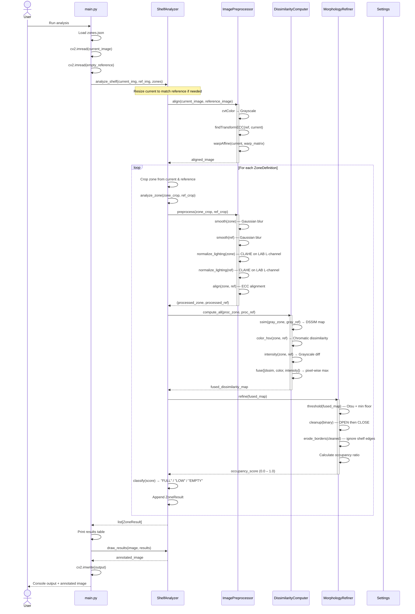
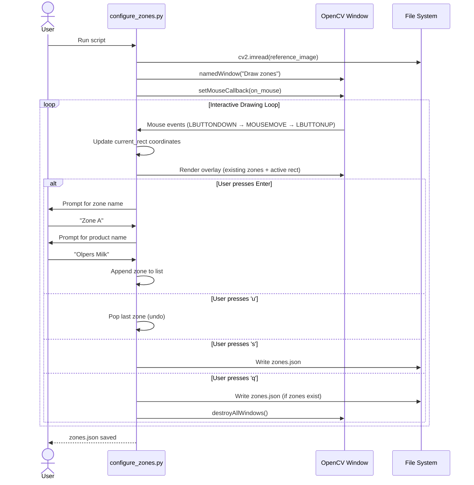
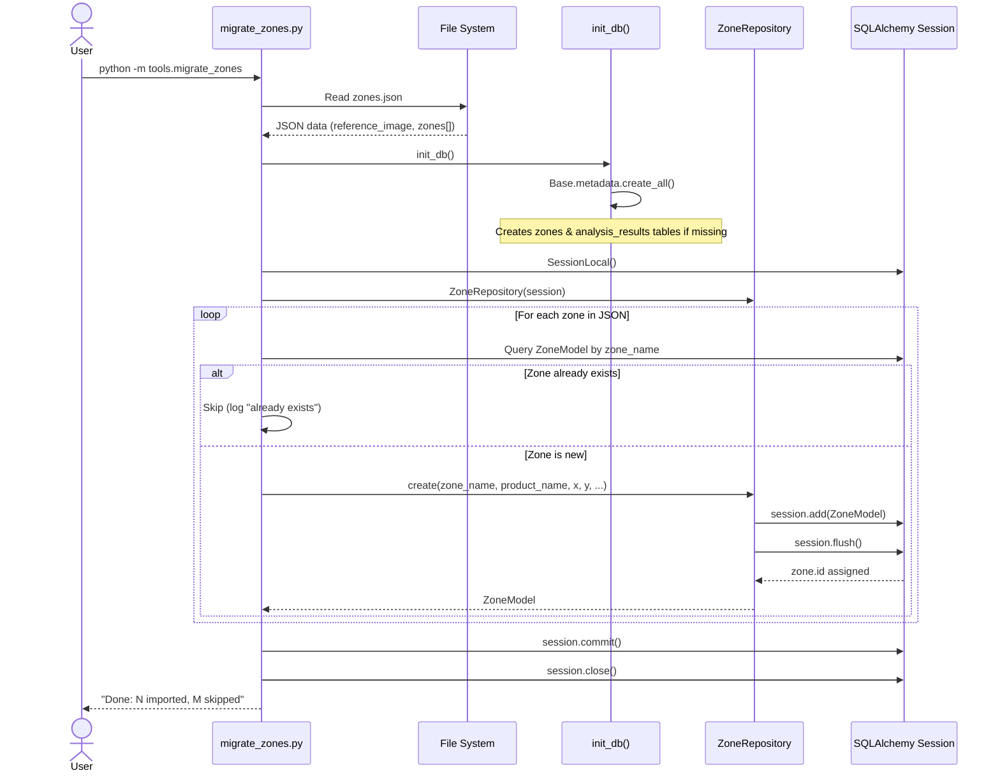
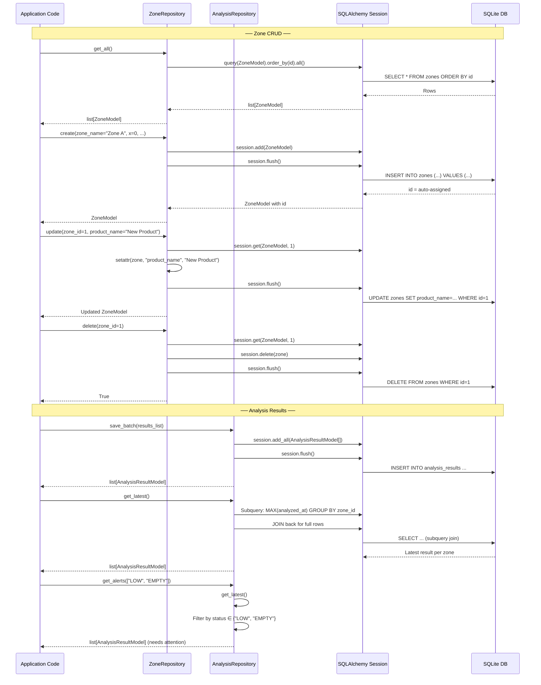
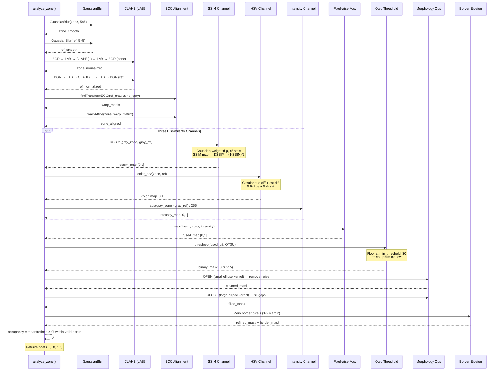

# ShelfSense — Sequence Diagrams

## 1. Main Shelf Analysis Pipeline

The primary flow: analyzing a shelf image against an empty reference to determine zone occupancy.

---

## 2. Zone Configuration Flow

Interactive tool for drawing zones on a shelf reference image.

---

## 3. Zone Migration Flow (JSON → SQLite)

One-time migration of zone definitions from `zones.json` into the database.

---

## 4. Database CRUD Operations

How the repository layer mediates all database interactions.

---

## 5. CV Pipeline Detail — Single Zone Processing

A deeper look at the image processing stages within `analyze_zone`.

